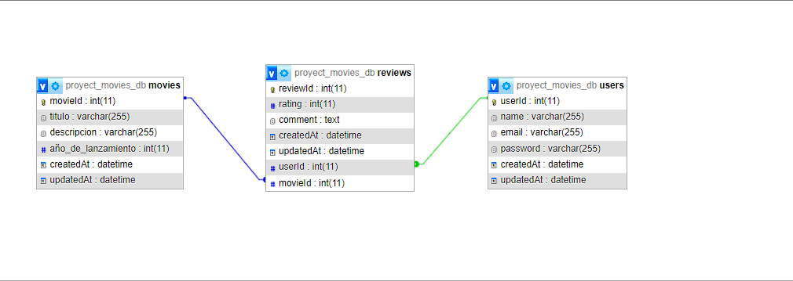

(ORT_YA_TALLER_II_TP_API_RESTful_Curso_E_ALCARAZ_NICOLAS)          
                                            Proyecto API de Gestión de Reseñas de Películas. 

Descripción:
    Esta API permite a los Usuarios gestionar Reseñas sobre Películas.
    También incluye la creación, lectura, actualización y eliminación de usuarios, películas y reseñas.

Alcance el proyecto:
    Usuarios: Loguear, Crear, leer, actualizar, eliminar usuarios,
    Películas: Crear, leer, actualizar y eliminar películas.
    Reseñas: Crear, leer, actualizar y eliminar reseñas.

Requerimientos Funcionales:

    1. Gestión de Usuarios:
        Permitir a los usuarios crear una cuenta, iniciar sesión, actualizar su perfíl y eliminar su cuenta.
    Entrada: 
        Crear cuenta: nombre, email, contraseña.
        Inicio sesión: email, contraseña
    Salida:
        Crear cuenta: Mensaje de éxito y detalles del usuario creado.
        Iniciar sesión: Token de autenticación y detalles del usuario.
        Actualizar perfil: Mensaje de éxito y detalles del usuario actualizado.
        Eliminar cuenta: Mensaje de confirmación de eliminación.

    2. Gestión de Películas:
        Descripción: Permitir a los usuarios crear, leer, actualizar y eliminar películas.
    Entrada: 
        Crear película: título, descripción, y año de lanzamiento.
        Actualizar película: título, descripción, director, año de lanzamiento.
    Salida:
        Crear película: Mensaje de éxito y detalles de la película creada.
        Actualizar película: Mensaje de éxito y detalles de la película actualizada.
        Obtener películas: Lista de películas con detalles.

    3. Gestión de Reseñas.
        Descripción: Permitir a los usuarios crear, leer, actualizar y eliminar reseñas de películas.
    Entrada:
        Crear reseña: usuarioId, peliculaId, rating, comentario.
        Actualizar reseña: usuarioId,peliculaId, rating, comentario.
    Salida:
        Crear reseña: Mensaje de éxito y detalles de la reseña actualizada.
        Actualizar reseña: Mensaje de éxito y detalles de la reseña actualizada.
        Obtener reseña: Lista de reseñas con detalles.

Requerimientos No Funcionales:

    Rendimiento: Responder a las solicitudes en menos de 2 segundos.
    Seguridad: Cifrar contraseñas de los usuarios.

Diagrama Lógico Relacional:
    
    Relacion de Usuario con Reseña: Un usuario puede escribir muchas reseñas, pero cada reseña es escrita por un solo usuario. (1 a muchos).
    Relacion de Película con Reseña: Una película puede tener muchas reseñas, pero cada reseña pertenece a una sola película. (1 a muchos).

Ejecutar el proyecto:
    Requisitos: 
    -Node.js y npm instalados.

    1- Clonar el repositorio: git clone https://github.com/nicolasalcaraz18/proyectoAPI.git
    2- Instalar dependencias: npm install
    4- Configurar variables de entorno:DB_HOST,DB_USER,DB_PASSWORD,DB_NAME,DB_DIALECT,SECRET.
    5- Levantar la base de datos (XAMP) 
    6- Ejecutar el proyecto: (para modo desarrollo: npm run dev), (para producción ejecutar: npm start)
    7- Uso de la API: Utilizar herramientas como Postman o Thunder Client. 
    8- Rutas: 
            POST /login: Iniciar sesión.
            POST /users: Crear un nuevo usuario.
            GET /users: Obtener todos los usuarios.
            POST /movies: Crear una nueva película.
            GET /movies: Obtener todas las películas.
            POST /reviews: Crear una nueva reseña.
            GET /reviews: Obtener todas las reseñas.

    

